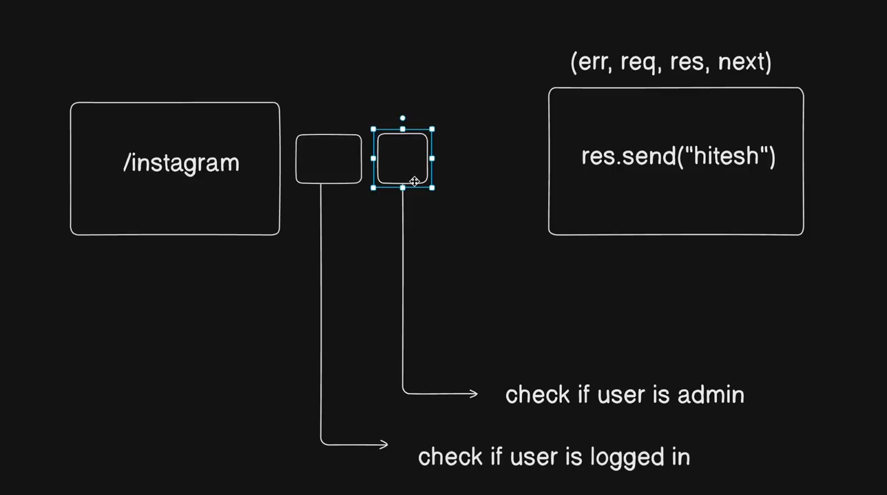

# middlewares and other packages
- app.use() for middlwares or config purposes
- req.body parser is no longer needed default now in express
- req.body can have data in various formats

## cookie-parser(is a middleware)
```js
app.use(cors({
    origin: process.env.CORS_ORIGIN, //* which origins we allowed
    credentials: true // allow credentials
}))
```

- app.use() for middlwares and configuration
- read npm.js cookie-parser
- acccess cookies from user browser and set them (CRUD operations)
- secure cookies: server only
## cors

- both above are configured after app() is made

## multer
- middleware used for configuration of file uploading : not by default in express

## diagram


- middlewares to do checking between req and res
- like checke if logged in before sending response
- next is a flag of middlewares. work done => pass the flag next 
- discard next at end after sending response