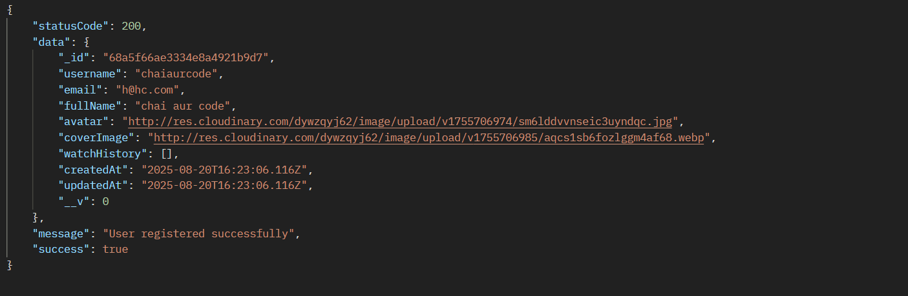

# first step
- send post request
- with body -> raw -> json -> {
    "email" : "h@hc.com",
    "password": ""
}

# to send files
- body->form- data
- form-data can send files
- raw json cant send files
- must be ticked
- keys must have same name as data model fields

## for files
- key -> dropdown-> file -> select file
- full user response received in postman

## note

- delete image files from local server and cloudinary each time during failed execution

- this full came after creation of user. so necessary to remove password and refresh token

# imp
- model fields must have same name everywhere starting from model to controllers to postman key

## todo
- console log cloudinary response, req.body in user controller, req.files, 

# postman setup at end of part 1 video backend

## header for auth.middleware
- headers -> key(Authorisation) -> value(Beare "token name")

## FOR LOGIN

